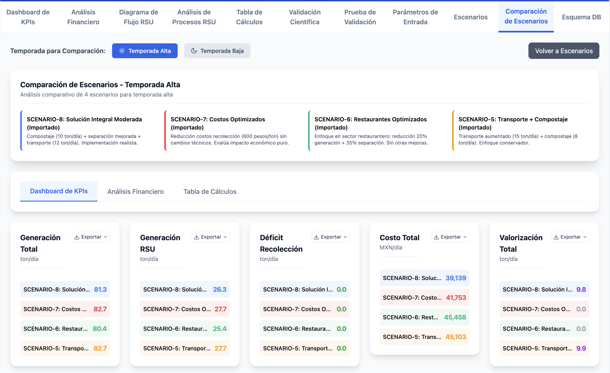

# Manual de Usuario - Simulador de Residuos Sólidos Urbanos de Holbox

## **1. Introducción**

### 1.1. Propósito del Simulador
El Simulador de Residuos Sólidos Urbanos de Holbox es una herramienta de modelado integral que permite analizar y optimizar el sistema de gestión de residuos de la Isla Holbox. La aplicación simula el flujo completo de residuos desde la generación hasta la disposición final, incluyendo procesos de valorización y programas de separación en origen.

### 1.2. Alcance del Manual
Este manual cubre todas las funcionalidades de la interfaz de usuario, proporcionando instrucciones detalladas para configurar escenarios, interpretar resultados y realizar análisis comparativos. El simulador está desplegado en: https://waste-simulator.vercel.app/

---

## **2. Vista General de la Interfaz**

La interfaz principal del simulador está organizada en varias secciones clave:

- **Panel de Entradas**: Ubicado en la parte superior, permite configurar todos los parámetros del escenario
- **Dashboard de KPIs**: Muestra indicadores clave de rendimiento del sistema
- **Dashboards de Análisis**: Incluye análisis de procesos, financiero y diagrama de flujo
- **Tabla de Resultados**: Presenta cálculos detallados de la simulación
- **Gestión de Escenarios**: Funciones para guardar, cargar y comparar escenarios

---

## **3. Guía de Uso Paso a Paso**

### 3.1. Panel de Entradas (Parámetros del Escenario)

El panel de entradas es el punto de partida para configurar cualquier simulación. Se organiza en tarjetas temáticas que agrupan parámetros relacionados.

#### **Parámetros Generales**
- **Población Fija**: Número de habitantes permanentes de la isla
- **% Ocupación Hotelera (Alta)**: Porcentaje de ocupación durante temporada alta
- **% Ocupación Hotelera (Baja)**: Porcentaje de ocupación durante temporada baja

#### **Generación de RSU por Sector**
Cada sector generador tiene tres parámetros configurables:

**Hoteles:**
- **# de Cuartos**: Número total de cuartos hoteleros
- **Tasa Generación**: Kilogramos de residuos por cuarto por día
- **% Separación Origen**: Porcentaje de residuos separados en origen

**Restaurantes:**
- **# de Locales**: Número de establecimientos de alimentos
- **Tasa Generación**: Kilogramos por local por día
- **% Separación Origen**: Eficiencia de separación en origen

**Hogares:**
- **Tasa Generación**: Kilogramos per cápita por día
- **% Separación Origen**: Eficiencia de separación domiciliaria

**Comercios:**
- **# de Locales**: Número de establecimientos comerciales
- **Tasa Generación**: Kilogramos por local por día
- **% Separación Origen**: Eficiencia de separación comercial

#### **Sistema RSU: Configuración Operativa**

**Logística:**
- **# de Vehículos**: Número de camiones recolectores
- **Capacidad Vehículo**: Capacidad de carga por vehículo (toneladas)
- **Viajes/Vehículo/Día**: Número de viajes por vehículo por día

**Procesamiento:**
- **Tasa Procesamiento**: Capacidad de procesamiento de la planta (ton/día)
- **Capacidad Almacenamiento**: Capacidad máxima de almacenamiento (toneladas)
- **Capacidad Traslado Diario**: Capacidad de traslado final (ton/día)

#### **Valorización de Residuos**

El simulador incluye tres tecnologías de valorización que pueden activarse individualmente:

**Compostaje:**
- **Habilitar Compostaje**: Checkbox para activar el proceso
- **Eficiencia de Compostaje**: Porcentaje de material procesado exitosamente
- **Costo de Compostaje**: Costo operativo por tonelada procesada
- **Ingresos por Compost**: Ingresos por venta de compost producido

**Biogás:**
- **Habilitar Biogás**: Checkbox para activar la generación de biogás
- **Eficiencia de Biogás**: Porcentaje de conversión de residuos orgánicos
- **Costo de Biogás**: Costo operativo del sistema de biogás
- **Ingresos por Biogás**: Ingresos por venta de energía/gas

**Pirólisis de Plásticos:**
- **Habilitar Pirólisis**: Checkbox para activar el proceso
- **Eficiencia de Pirólisis**: Porcentaje de conversión de plásticos
- **Costo de Pirólisis**: Costo operativo del sistema
- **Ingresos por Pirólisis**: Ingresos por productos derivados

### 3.2. Programas de Separación en Origen

Los programas de separación pueden habilitarse mediante un interruptor maestro y configurarse individualmente:

**Programa de Educación:**
- **Impacto por Sector**: Mejora porcentual en separación para cada sector
- **Costo per Cápita**: Costo anual del programa educativo

**Programa de Incentivos:**
- **Impacto por Sector**: Mejora porcentual adicional por incentivos
- **Costo por Tonelada**: Costo por tonelada de material separado

**Programa de Contenedores:**
- **Impacto por Sector**: Mejora por disponibilidad de contenedores
- **Costo por Unidad**: Costo por set de contenedores diferenciados

### 3.3. Composición de Residuos

Cada sector generador tiene una composición configurable que debe sumar 100%:
- **Orgánicos**: Material compostable
- **PET**: Botellas plásticas reciclables
- **Aluminio**: Latas y envases metálicos
- **Cartón/Papel**: Material celulósico reciclable
- **Vidrio**: Envases de vidrio
- **Rechazo**: Material no recuperable
- **Peligrosos**: Residuos que requieren manejo especial

### 3.4. Dashboard de Indicadores Clave (KPIs)

El dashboard de KPIs presenta los resultados más importantes del escenario simulado:

#### **KPIs Principales**
- **Generación Total Diaria**: Suma de RSU, Sargazo y RCD por temporada
- **Generación RSU Diaria**: Residuos sólidos urbanos exclusivamente
- **Déficit Recolección RSU**: Material no recolectado por falta de capacidad
- **Costo Total del Sistema**: Costo neto diario incluyendo todos los flujos

#### **Métricas de Valorización** (cuando aplique)
- **Total Valorizado**: Material desviado de disposición final
- **% Desviación de Disposición**: Porcentaje de RSU valorizado
- **Ingresos Valorización**: Ingresos por venta de productos valorizados
- **Costo Neto Valorización**: Balance entre costos e ingresos

#### **Efectividad de Programas de Separación** (cuando aplique)
- **Costo Programas**: Costo total de programas activos
- **Mejora Promedio**: Mejora promedio en tasas de separación
- **Material Adicional**: Material adicional recuperado por programas
- **Costo por Mejora**: Eficiencia económica de los programas

#### **Inventarios del Sistema**
Muestra niveles de acumulación en cada etapa:
- **Vehículos Recolección**: Material en vehículos recolectores
- **Estación Transferencia**: Material acumulado en planta
- **Vehículos Traslado**: Material en vehículos de traslado final
- **Sitio Disposición**: Material acumulado en sitio de disposición

### 3.5. Análisis de Procesos

-2025-09-06%20(1).png)

El análisis de procesos visualiza el flujo de residuos a través de cuatro etapas principales:

#### **Recolección**
- **Tasa de Entrada**: RSU generado diariamente
- **Tasa de Salida**: Material efectivamente recolectado
- **Recuperación Informal**: Material recuperado por pepenadores en ruta
- **Fuga en Ruta**: Material perdido durante recolección
- **Uso Capacidad Vehículos**: Porcentaje de utilización de la flota

#### **Estación de Transferencia**
- **Tasa de Entrada**: Material que llega a la estación
- **Tasa de Salida**: Material que sale hacia traslado final o valorización
- **Reciclaje Alta/Baja Calidad**: Material recuperado por calidad
- **Valorización**: Material procesado por tecnologías de valorización
- **Uso Capacidad Almacenamiento**: Porcentaje de utilización del almacén

#### **Traslado Final**
- **Tasa de Entrada**: Material destinado a traslado
- **Tasa de Salida**: Material efectivamente trasladado
- **Fuga en Traslado**: Pérdidas durante el transporte
- **Uso Capacidad Transporte**: Eficiencia del sistema de traslado

#### **Disposición Final**
- **Tasa de Entrada**: Material que llega al sitio de disposición
- **Recuperación Informal**: Material recuperado en el sitio
- **Fuga en Sitio**: Pérdidas en el sitio de disposición
- **Inventario Acumulado**: Material acumulado en el sitio

### 3.6. Análisis Financiero

-2025-09-06.png)

El análisis financiero desglosa costos e ingresos del sistema:

#### **Desglose de Costos**
- **Costo Base RSU**: Operaciones estándar del sistema
- **Gestión Sargazo**: Costos específicos de manejo de sargazo
- **Gestión RCD**: Costos de residuos de construcción y demolición
- **Programas Separación**: Costos de programas educativos e incentivos
- **Costos Valorización**: Costos operativos de tecnologías de valorización

#### **Fuentes de Ingresos**
- **Reciclaje por Material**: Ingresos por venta de PET, aluminio, cartón, vidrio
- **Ingresos Valorización**: Ingresos por productos de valorización

#### **Análisis Costo-Beneficio**
- **ROI de Programas**: Retorno de inversión de programas implementados
- **Impacto Neto**: Balance económico de intervenciones
- **Estructura de Costos**: Comparación de componentes principales

### 3.7. Tabla de Resultados Detallados

La tabla de resultados presenta todos los cálculos intermedios organizados por etapas:

#### **Estructura de la Tabla**
- **Concepto**: Descripción del parámetro calculado
- **Valor**: Resultado numérico con precisión decimal
- **Unidad**: Unidad de medida (ton/día, MXN/día, %, etc.)
- **Inputs y Desglose**: Fórmula de cálculo y parámetros utilizados

#### **Navegación**
- **Exportar CSV**: Botón para descargar resultados en formato de hoja de cálculo
- **Código de Colores**: Filas destacadas indican valores críticos o de atención
- **Jerarquía Visual**: Indentación muestra relaciones entre cálculos

### 3.8. Diagrama de Flujo del Sistema

-2025-09-06.png)

El diagrama de flujo proporciona una representación visual del recorrido de los residuos:

#### **Elementos del Diagrama**
- **Cajas de Proceso**: Representan las etapas principales del sistema
- **Flechas de Flujo**: Indican el movimiento de material entre etapas
- **Flechas de Pérdida**: Muestran material que sale del flujo principal
- **Indicadores de Mejora**: Badges que señalan programas activos

#### **Procesos de Valorización**
Cuando están activos, se muestra una sección dedicada con:
- **Procesos Individuales**: Compostaje, biogás, pirólisis
- **Volúmenes Procesados**: Cantidad diaria por proceso
- **Ingresos Generados**: Beneficio económico de la valorización

---

## **4. Gestión de Escenarios**

### 4.1. Guardar y Cargar Escenarios

#### **Guardar Escenario Actual**
1. Haga clic en el botón "Guardar Actual" en la sección de gestión de escenarios
2. En el modal que aparece, introduzca:
   - **Nombre del Escenario**: Identificador único y descriptivo
   - **Descripción**: Explicación opcional del propósito del escenario
3. Haga clic en "Guardar" para almacenar la configuración actual

#### **Cargar Escenario Existente**
1. Localice el escenario deseado en la lista de escenarios guardados
2. Haga clic en el botón "Cargar" del escenario
3. La configuración se aplicará automáticamente y la simulación se actualizará

#### **Eliminar Escenario**
1. Haga clic en el ícono de papelera junto al nombre del escenario
2. Confirme la eliminación en el diálogo de confirmación
3. El escenario se eliminará permanentemente

### 4.2. Exportar e Importar Escenarios

#### **Exportar Escenarios a CSV**
1. Haga clic en el botón "Exportar CSV"
2. El sistema generará un archivo CSV con todos los escenarios guardados
3. El archivo se descargará automáticamente con timestamp

#### **Importar Escenarios desde CSV**
1. Haga clic en el botón "Importar CSV"
2. Seleccione un archivo CSV previamente exportado
3. Los escenarios se importarán con el sufijo "(Importado)"
4. Se mostrará un resumen del proceso de importación

### 4.3. Comparación de Escenarios

#### **Activar Modo Comparación**
1. Haga clic en el botón "Modo Comparación" (disponible con 2+ escenarios)
2. Aparecerán checkboxes junto a cada escenario
3. Seleccione entre 2 y 4 escenarios para comparar
4. Haga clic en "Comparar Seleccionados"

#### **Dashboard de Comparación**
El módulo de comparación incluye tres pestañas:

**Dashboard de KPIs:**

- Comparación lado a lado de métricas clave
- Gráficos de barras comparativos
- Tablas resumen con codificación de colores

**Análisis Financiero:**

- Comparación de costos e ingresos entre escenarios
- Análisis de eficiencia económica
- ROI comparativo de programas

**Tabla de Cálculos:**

- Tabla detallada con todos los cálculos por escenario
- Posibilidad de exportar comparaciones completas
- Análisis línea por línea de diferencias

---

## **5. Validación y Restricciones del Sistema**

### 5.1. Validación de Conservación de Masa

El simulador incluye validaciones automáticas para asegurar la coherencia de los resultados:

- **Balance de Masa**: Verificación de que todo el material generado es contabilizado
- **Error Máximo**: El sistema mantiene errores por debajo del 0.01%
- **Alertas Automáticas**: Se muestran advertencias si se detectan inconsistencias

### 5.2. Restricciones Físicas

El sistema impone restricciones realistas:

- **Capacidades Máximas**: Los inventarios no pueden exceder capacidades físicas
- **Tasas de Procesamiento**: Los procesos respetan limitaciones de equipos
- **Coherencia Temporal**: Los flujos mantienen coherencia temporal

---

## **6. Exportación de Datos**

### 6.1. Exportación de Gráficos
- Cada gráfico incluye un botón de exportación en la esquina superior derecha
- Los gráficos se pueden exportar como imágenes PNG de alta resolución
- El nombre del archivo incluye automáticamente el título del gráfico y timestamp

### 6.2. Exportación de Datos Tabulares
- Las tablas incluyen botones "Exportar CSV" para descarga de datos
- Los archivos CSV mantienen la estructura y precisión de los datos originales
- Formato compatible con Excel y otras aplicaciones de hoja de cálculo

### 6.3. Exportación de Escenarios Completos
- Los escenarios pueden exportarse/importarse para respaldo o intercambio
- El formato CSV incluye toda la configuración de parámetros
- Permite la portabilidad entre diferentes instalaciones del simulador

---

## **7. Interpretación de Resultados**

### 7.1. Temporadas
- **Temporada Alta**: Considera ocupación hotelera máxima y mayor generación
- **Temporada Baja**: Escenario con ocupación reducida y generación menor
- **Selector de Temporada**: Permite alternar entre ambos escenarios en tiempo real

### 7.2. Códigos de Color
- **Verde**: Valores positivos, eficiencias altas, situaciones favorables
- **Rojo**: Déficits, fugas, situaciones que requieren atención
- **Amarillo/Naranja**: Valores intermedios, alertas moderadas
- **Azul**: Valores neutros, información general
- **Púrpura**: Actividades de valorización y programas especiales

### 7.3. Precisión de Datos
- **Simulación de 30 días**: Los resultados son promedios de simulaciones de un mes
- **Días de Estabilización**: Los primeros días de simulación no se consideran en promedios
- **Precisión Decimal**: Los valores se muestran con precisión apropiada según el contexto

---

## **8. Mejores Prácticas**

### 8.1. Configuración de Escenarios
- **Nombres Descriptivos**: Use nombres que describan claramente el propósito del escenario
- **Documentación**: Aproveche el campo de descripción para documentar supuestos
- **Validación Gradual**: Realice cambios incrementales y valide resultados paso a paso

### 8.2. Análisis de Sensibilidad
- **Un Parámetro a la Vez**: Cambie un parámetro por vez para entender su impacto
- **Escenarios Base**: Mantenga un escenario de referencia para comparaciones
- **Rangos Realistas**: Use valores dentro de rangos operativamente factibles

### 8.3. Comparación de Escenarios
- **Máximo 4 Escenarios**: Limite las comparaciones a 4 escenarios para claridad
- **Escenarios Relacionados**: Compare escenarios que difieran en aspectos específicos
- **Documentación de Diferencias**: Documente qué parámetros cambian entre escenarios

---

## **9. Resolución de Problemas Comunes**

### 9.1. Errores de Composición
**Problema**: Advertencias de composición que no suma 100%
**Solución**: Ajuste los porcentajes de composición hasta que la suma sea exactamente 100%

### 9.2. Déficits de Capacidad
**Problema**: Déficits altos en recolección o procesamiento
**Solución**: Incremente el número de vehículos, capacidad o frecuencia de operación

### 9.3. Costos Negativos Inesperados
**Problema**: Aparecen costos negativos en el análisis financiero
**Solución**: Verifique que los ingresos por valorización no excedan costos de manera irreal

### 9.4. Simulación No Responsive
**Problema**: La interfaz no responde después de cambios
**Solución**: Espere a que complete la simulación de 30 días, especialmente con configuraciones complejas

---

## **10. Soporte Técnico**

Para soporte técnico adicional o reporte de problemas:
- **Repositorio**: https://github.com/ramphastoslangosta/waste-simulator.git
- **Documentación Técnica**: Consulte los archivos de documentación en el repositorio
- **Issues**: Reporte problemas técnicos a través del sistema de issues de GitHub

---

*Manual generado para la versión de producción del Simulador de Residuos Sólidos Urbanos de Holbox. Para la versión más actualizada de este manual, consulte la documentación en el repositorio del proyecto.*
